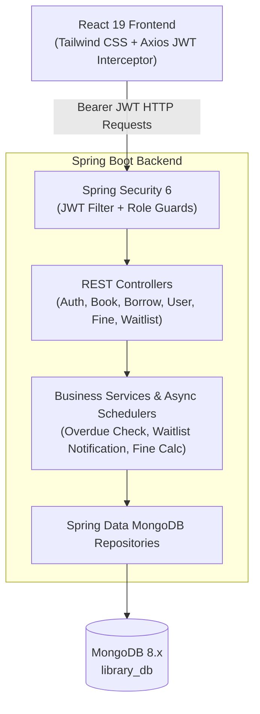

# SmartLibrary — Role-Based Digital Book Lending & Library Management Platform


---

## 📖 Overview

**SmartLibrary** is an enterprise-grade, full-stack **Role-Based Library Management & Digital Book Lending Platform**. Migrated from legacy MySQL to **MongoDB**, the platform delivers a modern, high-performance architecture with **Spring Boot 3**, **Spring Security 6 with stateless JWT authentication**, and a modern **React 19 + Tailwind CSS** frontend.

The platform provides two visual and operational experiences:
* **Administrator Portal (Midnight Navy & Emerald Theme)**: Real-time circulation command, inventory management, user auditing, borrow approvals/returns, penalty waivers, activity audit logs, dynamic system parameters, and CSV reporting.
* **Reader / Member Portal (Crisp Slate & Indigo Theme)**: Real-time catalog discovery with live stock badges, 1-click borrow requests, automated out-of-stock waitlists, personal reading logs, active loan due-date countdowns, favorites bookmarks, and in-app notifications.

---

## 🏛️ System Architecture



---

## 🚀 Key Features

### 1. Robust Role-Based Security (RBAC)
* **BCrypt Hashing**: Passwords stored using industry-standard salted BCrypt.
* **Stateless JWT**: Secure tokens with payload claims (`userId`, `role`, `email`).
* **Role Guards**: Strict separation between `ROLE_ADMIN` and `ROLE_USER`. Normal user signups are permanently restricted to `ROLE_USER`. Admin endpoints reject non-admin tokens with `403 Forbidden`.
* **Account Status**: Admins can block or reactivate user accounts.

### 2. Digital Lending Lifecycle
* **Borrow Request**: Reader requests an in-stock book (`PENDING`).
* **Admin Approval**: Admin reviews and approves request (`BORROWED`), which automatically decrements physical inventory (`availableCopies`).
* **Due Date Tracking**: Loans are issued with a default 14-day window. Schedulers monitor due dates daily.
* **Automatic Penalties**: If returned past the due date, an automatic fine of **₹10 / day** is generated and recorded.
* **Return & Waitlist Notification**: Returning a book increments inventory. If a waitlist exists for the book, the next reader in FIFO queue is notified with priority checkout access.

### 3. Administrator Operations Suite
* **Interactive Operations Dashboard**: Live KPI counters, category distribution metrics, and audit feeds.
* **Catalog Suite**: Full CRUD with cover image uploads, ISBN, publication year, shelf locations, and featured flags.
* **Circulation Suite**: Tabbed view for Pending Approvals, Active Loans, Overdue Items, and All-time Circulation Records.
* **Fines & Penalties**: Track unpaid fines, collect payments, or grant official waivers.
* **System Settings**: Live configuration of daily fine rates, loan durations, and member checkout limits.
* **Audit Trail**: Immutable system logs recording actors, actions, timestamps, and IP addresses.
* **CSV Export**: 1-click downloads for Catalog and Borrowing datasets.

### 4. Interactive Reader Experience
* **Catalog Search & Filtering**: Instant search across titles, authors, categories, and ISBNs with stock indicators.
* **Active Book Manager**: View active loans with color-coded days-remaining countdown badges.
* **1-Click Returns**: Return books directly with confirmation dialogs.
* **Waitlist Reservation**: Join FIFO queues when books are out of stock.
* **Favorites**: Bookmark titles for future reading.
* **Notifications**: Alerts for loan approvals, due-date reminders, and waitlist availability.

---

## 🔐 Default Demo Accounts (Database Seeder)

Upon initial backend launch, the `DatabaseSeeder` initializes demo accounts and sample catalog titles:

| Role | Email | Password | Access |
| :--- | :--- | :--- | :--- |
| **Administrator** | `admin@library.com` | `Admin@123` | Full Admin Operations Portal (`/admin/*`) |
| **Reader / Member** | `reader@library.com` | `Reader@123` | Reader Portal & Catalog (`/user/*`) |

> 💡 *Both demo credentials can be filled automatically on the login page via the **Admin Demo** and **User Demo** buttons.*

---

## 🔌 API Documentation & Swagger UI

Once the backend is running, explore and test the interactive OpenAPI documentation:

* **Swagger UI**: [http://localhost:8081/swagger-ui/index.html](http://localhost:8081/swagger-ui/index.html)
* **OpenAPI 3 JSON Spec**: [http://localhost:8081/v3/api-docs](http://localhost:8081/v3/api-docs)

### Primary API Endpoints

| Method | Endpoint | Access | Description |
| :--- | :--- | :--- | :--- |
| `POST` | `/api/auth/register` | Public | Register new reader (`ROLE_USER`) |
| `POST` | `/api/auth/login` | Public | Authenticate and obtain JWT |
| `POST` | `/api/auth/forgot-password` | Public | Dispatch password reset token |
| `POST` | `/api/auth/reset-password` | Public | Set new password via token |
| `GET` | `/api/books` | Public | Browse all catalog books |
| `POST` | `/api/books` | Admin | Create book with multipart image upload |
| `POST` | `/api/borrow/request` | User | Submit book checkout request |
| `PUT` | `/api/borrow/{id}/approve` | Admin | Approve checkout & decrement copies |
| `PUT` | `/api/borrow/{id}/return` | User / Admin | Return book, increment stock, calc fine |
| `POST` | `/api/reservations/join` | User | Join waitlist for checked-out book |
| `GET` | `/api/fines/admin/all` | Admin | View all system fines |
| `PUT` | `/api/fines/{id}/pay` | Admin | Record fine settlement |
| `PUT` | `/api/fines/{id}/waive` | Admin | Waive penalty fee |
| `GET` | `/api/reports/dashboard` | Admin | Retrieve operational KPIs & metrics |
| `GET` | `/api/reports/export/books` | Admin | Download catalog CSV |
| `GET` | `/api/reports/export/borrows`| Admin | Download borrowing history CSV |

---

## 💻 Installation & Setup

### Prerequisites
* **Java**: JDK 17 or 21
* **Maven**: 3.8+
* **Node.js**: v18+ (Tested on Node 20 / 22 / 26)
* **MongoDB**: Local MongoDB instance running on port `27017` (`mongodb://localhost:27017/library_db`)

---

### Step 1: Start MongoDB
Ensure MongoDB is running locally:
```bash
# macOS (Homebrew)
brew services start mongodb-community
# or start directly
mongod --config /opt/homebrew/etc/mongod.conf
```

---

### Step 2: Run Backend (Spring Boot)
```bash
cd backend

# Compile and run unit tests
mvn clean test

# Launch backend application on port 8081
mvn spring-boot:run
```
* Backend runs at: `http://localhost:8081`
* Default Admin account is seeded automatically.

---

### Step 3: Run Frontend (React 19 + Tailwind CSS)
```bash
cd frontend

# Install dependencies (if not already installed)
npm install

# Start development server
npm start
```
* Frontend runs at: `http://localhost:3000`

---

## 🧪 Automated Testing

The backend includes comprehensive unit tests verifying security rules, borrowing validations, and penalty calculations:

```bash
cd backend
mvn test
```

Tested test suites:
* `AuthServiceTest`: Duplicate email rejection, password confirmation, role enforcement.
* `BorrowServiceTest`: Out-of-stock validation, checkout approvals, copy decrementing.
* `FineServiceTest`: Daily overdue fine calculation (overdue days $\times$ ₹10/day), payment marking, waiver audits.

---

## 📄 License
This project is open-source and licensed under the [MIT License](LICENSE).
